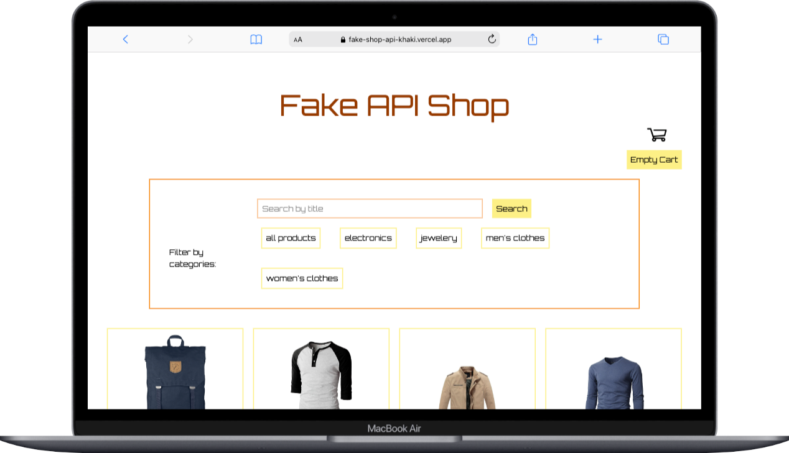
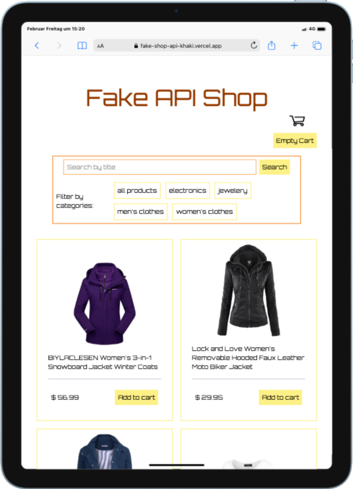
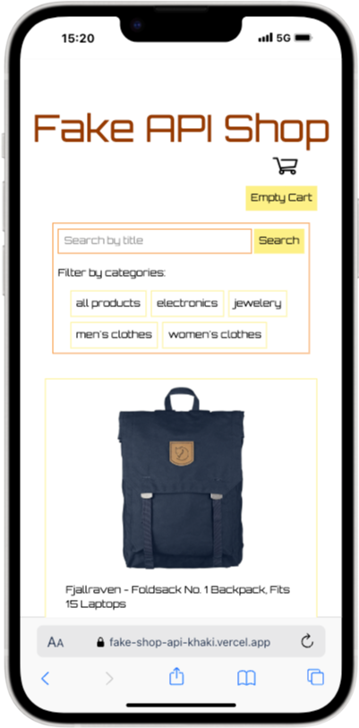

# Fake API Shop

Im Rahmen des sechsmonatigen Web-Development-Kurses habe ich das Projekt "Fake API Shop" während des "Typescript-Moduls" entwickelt. Das Projekt präsentiert die von der [FakeStoreAPI](https://fakestoreapi.com/) bereitgestellten Daten in Form eines fiktiven Online-Shops. Benutzerinnen und Benutzer können die Artikel nach Kategorien filtern und nach Schlagwörtern suchen, die im Titel der Artikel enthalten sind. Darüber hinaus besteht die Möglichkeit, Artikel im Local Storage zu speichern, um einen Warenkorb zu erstellen, dessen Umfang angezeigt wird und der jederzeit geleert werden kann. Die Webseite wurde responsiv gestaltet, um eine optimale Darstellung auf verschiedenen Endgeräten zu gewährleisten.

## Inhaltsverzeichnis 

- [Über das Projekt](#über-das-projekt)
- [Tech Stack](#tech-stack)
- [Getting Started](#getting-started)
  - [Voraussetzungen](#voraussetzungen)
  - [Installation](#installation)
- [Design](#design)
- [Deployment](#deployment)

## Über das Projekt

Für die Entwicklung dieses Projekts wurde Visual Studio Code als integrierte Entwicklungsumgebung verwendet. Die Webseite wurde mithilfe von HTML und Tailwind CSS gestaltet, um eine ansprechende und benutzerfreundliche Oberfläche zu schaffen. Die zugrunde liegenden Daten, einschließlich der Artikel und ihrer zugehörigen Informationen, stammen aus einer API. </br>
Jeder Artikel, zusammen mit ausgewählten Informationen darüber, wird dynamisch in das DOM integriert und mit TypeScript verarbeitet, um eine interaktive und skalierbare Darstellung der Inhalte zu gewährleisten. </br>
Die Nutzerinnen und Nutzer können die Artikel mithilfe einer integrierten Suchfunktion gezielt nach Schlagwörtern aus den Titeln filtern. Darüber hinaus sind die Artikel des Online-Shops in vier Kategorien unterteilt, die durch entsprechende Schaltflächen zugänglich sind. Dies ermöglicht es den Nutzern, gezielt nur die Artikel einer bestimmten Kategorie anzuzeigen.
Der Warenkorb wird durch den Einsatz von *localStorage* realisiert. Alle Artikel, die in den Warenkorb gelegt werden, werden im *localStorage* gespeichert, sodass sie auch bei einem Seitenreload erhalten bleiben. Die Artikel können jederzeit über den "Empty Cart"-Button gelöscht werden, der alle gespeicherten Artikel entfernt. </br>
Die Menge der im Warenkorb hinzugefügten Artikel wird durch einen Zähler angezeigt, der sich neben dem Warenkorb-Icon befindet. Dies sorgt für eine klare und benutzerfreundliche Darstellung der Warenkorbinhalte.

<div style="display: flex; justify-content: space-between; align-items: center; width: 100%">
    
    
    
</div>

## Tech Stack

**Markup:**  
  

**Styling:**  

  

**IDE:**  
  

**TS:**<br/>


**Version Control:**  
  


## Getting Startet

Hier ist eine Anleitung, wie du das "Fake API Shop"-Projekt auf deinem lokalen Rechner einrichtest und ausführst:

### Voraussetzungen

Folgende Programme solltest du installiert haben:

- [Git](https://git-scm.com/)
- [VS Code](https://code.visualstudio.com/download)
- [Vite](https://v5.vite.dev/guide/)
- [Tailwind CSS](https://tailwindcss.com/docs/installation/using-vite)

### Installation

1. **Clone das "Repository":**
   ```bash
   git clone https://github.com/YvonneJL/Fake_Shop_API
   ```

### Ausführen des Projekts

2. **Öffne das Projekt und installiere Vite und Tailwind Css, indem du den Instruktionen auf den oben verlinkten Webseiten folgst :**
 
**Alles ist eingerichtet! Nun kannst du das "Fake API Shop"-Projekt erkunden und deinen Warenkorb füllen.

## Design

Für das Design des Projekts gab es keine spezifischen Vorgaben, da der Schwerpunkt auf der praktischen Anwendung von TypeScript lag. Ich habe mich bewusst für einen Retro-Look entschieden, da dieser meiner Meinung nach gut zu den angebotenen Artikeln des Shops passt und gleichzeitig eine ansprechende visuelle Ästhetik bietet.


## Deployment

Hier gelangst du direkt zur Webseite
- [Fake API Shop](https://fake-shop-api-khaki.vercel.app/)
